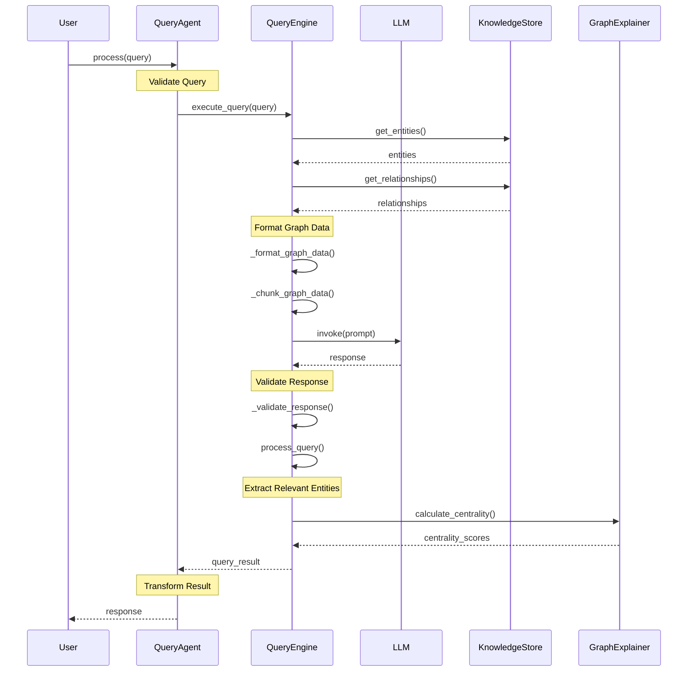
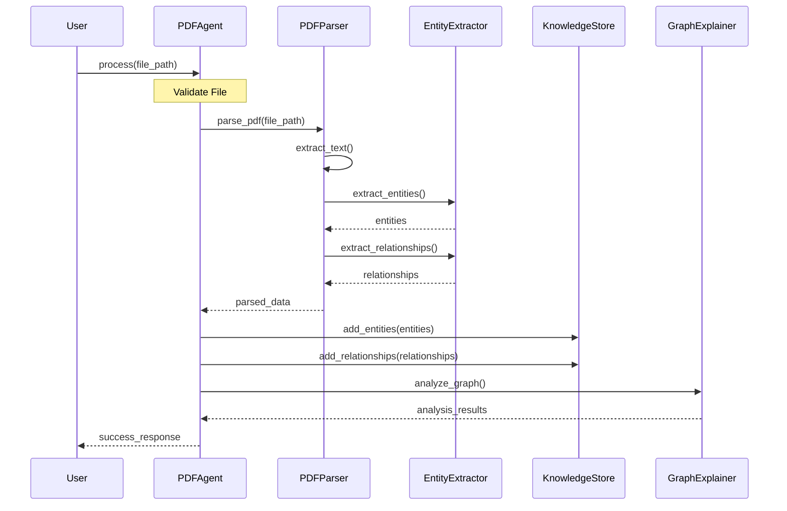
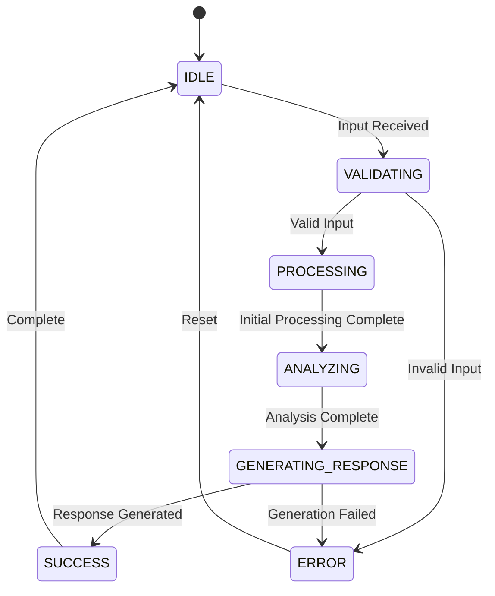
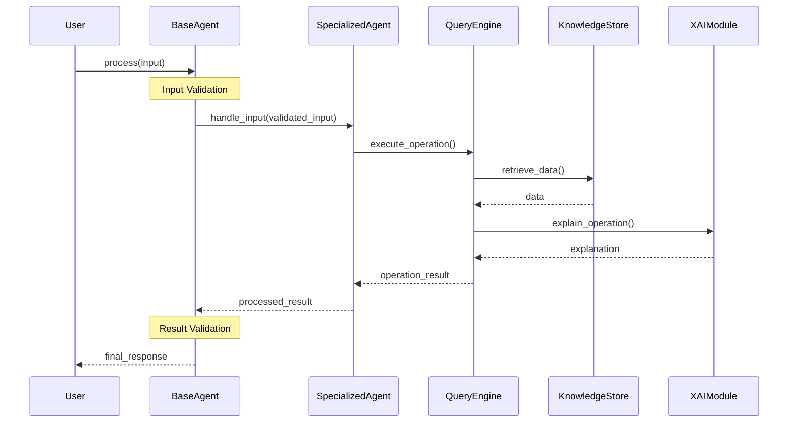
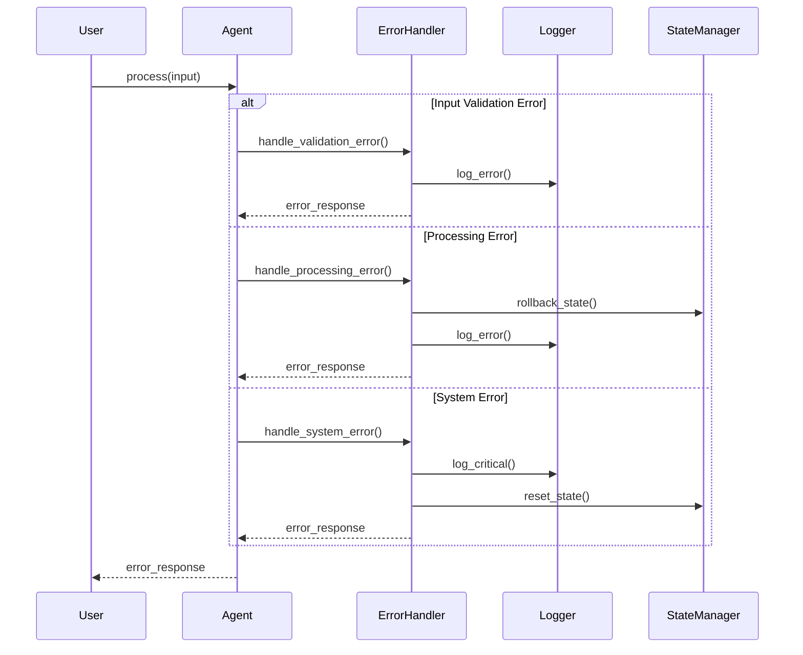
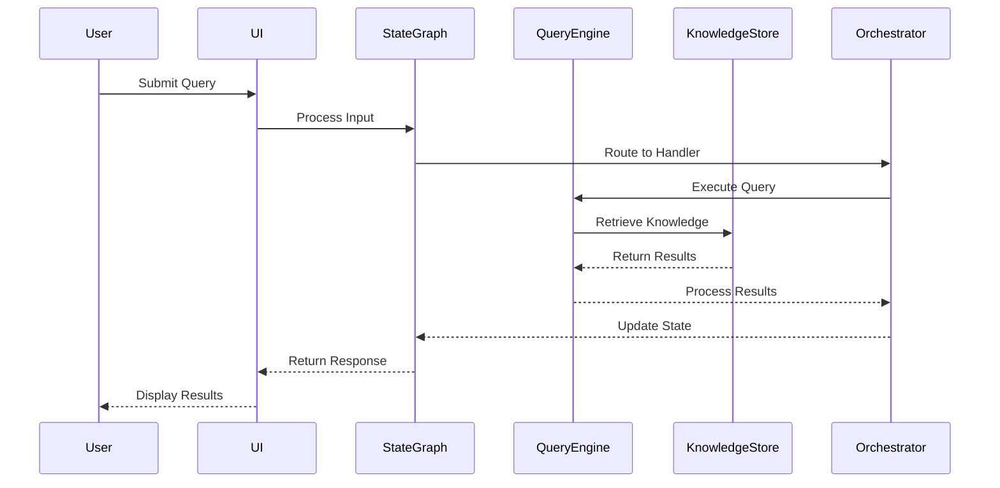
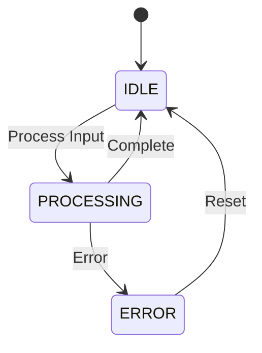
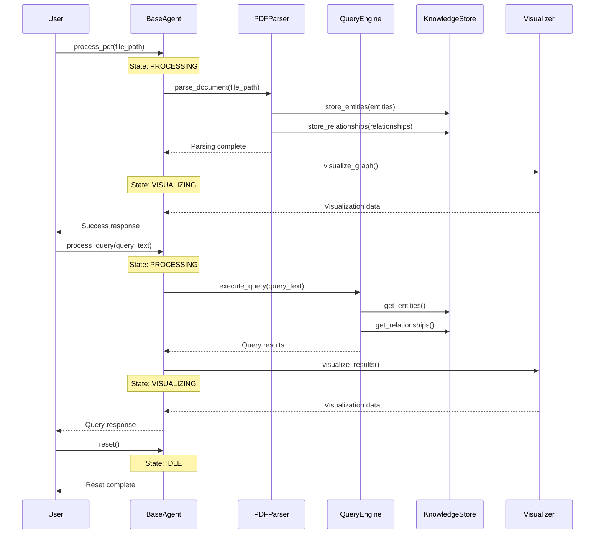

# Agent System Sequence Diagram

## Query Processing Flow

## PDF Processing Flow

## Agent State Management

## Component Interactions

## Error Handling Flow

## Diagram Explanation

The updated sequence diagrams illustrate the enhanced interaction flows in the CognisGraph system:

1. **Query Processing Flow**:
   - Improved query validation
   - LLM integration for natural language processing
   - Graph data chunking and caching
   - Response validation and transformation
   - Centrality metrics calculation
   - Enhanced error handling

2. **PDF Processing Flow**:
   - Robust file validation
   - Parallel entity and relationship extraction
   - Graph analysis with XAI features
   - Structured response generation

3. **State Management**:
   - More granular state transitions
   - Better error recovery
   - Clear success/failure paths

4. **Component Interactions**:
   - Clear separation of concerns
   - Standardized communication patterns
   - XAI integration at multiple levels

5. **Error Handling**:
   - Comprehensive error categorization
   - State management during errors
   - Detailed logging and recovery

## State Transitions

## Component Descriptions

1. **User Interface (UI)**
   - Handles user input and output
   - Manages file uploads
   - Displays query results and visualizations

2. **State Graph**
   - Manages workflow state
   - Routes input to appropriate handlers
   - Maintains state transitions

3. **Orchestrator**
   - Coordinates between components
   - Manages agent interactions
   - Handles error cases

4. **Query Engine**
   - Processes natural language queries
   - Retrieves relevant knowledge
   - Generates responses

5. **Knowledge Store**
   - Stores and retrieves knowledge
   - Maintains entity relationships
   - Provides query interface

## Workflow Steps

1. **Input Processing**
   - User submits query through UI
   - UI sends input to State Graph
   - State Graph routes to appropriate handler

2. **Query Execution**
   - Orchestrator receives input
   - Query Engine processes query
   - Knowledge Store retrieves relevant information

3. **Result Processing**
   - Query Engine processes results
   - Orchestrator updates state
   - State Graph returns response

4. **Output Generation**
   - UI receives response
   - Results are displayed to user
   - State is updated accordingly

## Diagram Explanation

This sequence diagram illustrates the interaction flow in the CognisGraph agent system:

1. **PDF Processing Flow**:
   - User calls `process_pdf()` with a file path
   - Agent transitions to PROCESSING state
   - PDFParser extracts knowledge
   - Knowledge is stored in KnowledgeStore
   - Visualization is generated
   - Agent transitions through states appropriately

2. **Query Processing Flow**:
   - User calls `process_query()` with query text
   - Agent transitions to PROCESSING state
   - QueryEngine processes the query
   - Results are retrieved from KnowledgeStore
   - Visualization is generated
   - Agent transitions through states appropriately

3. **Reset Flow**:
   - User can reset the agent
   - Agent returns to IDLE state
   - Context is cleared

The diagram shows how the BaseAgent manages state transitions and coordinates between different components while maintaining a clean separation of concerns. 