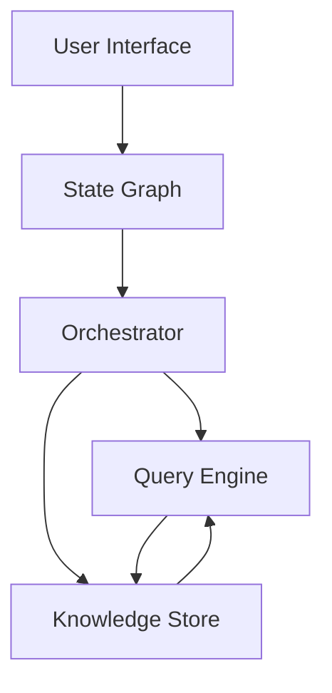
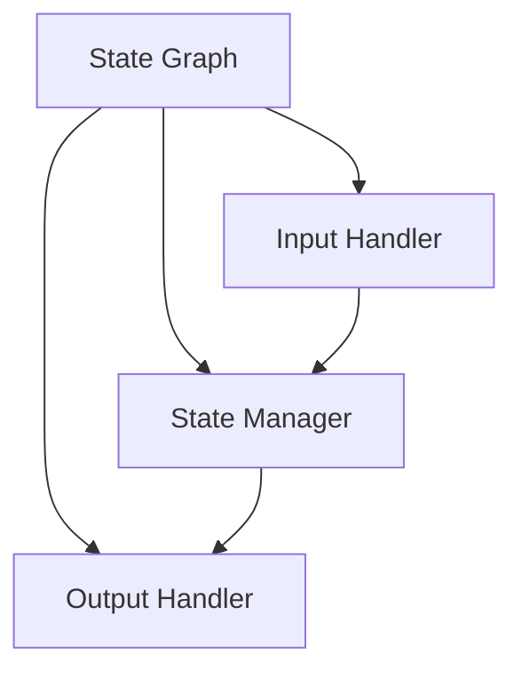
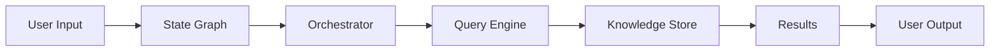
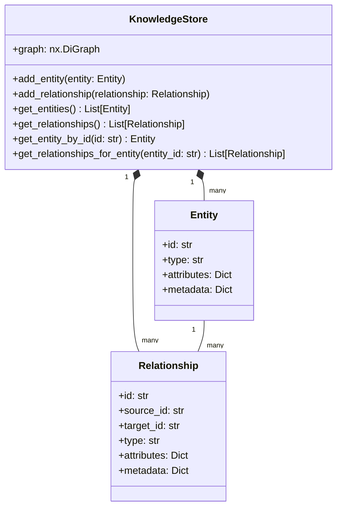
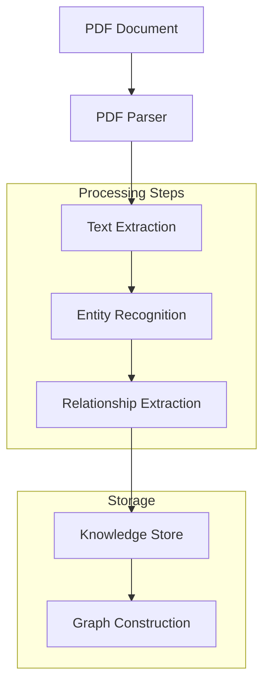
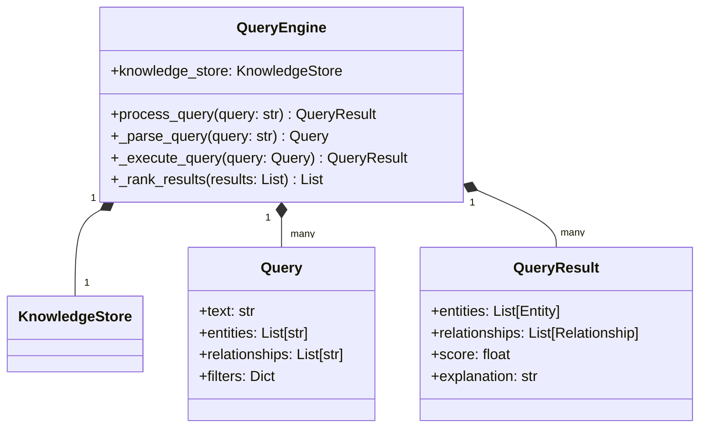
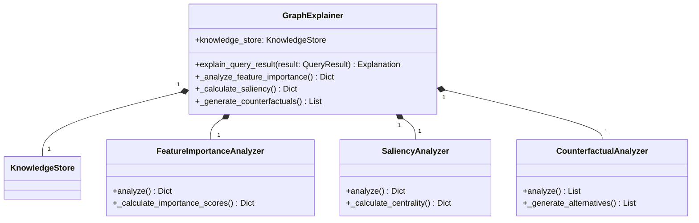
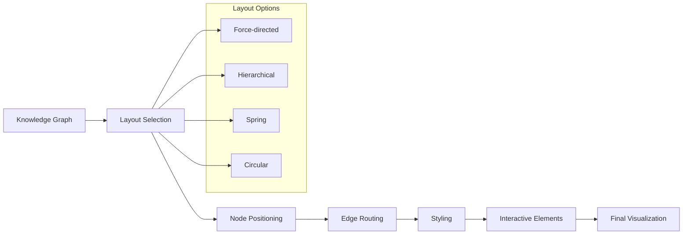

# Component Diagrams

## System Architecture

## State Management

## Knowledge Flow

## Component Responsibilities

1. **State Graph**
   - Manages state transitions
   - Routes input to appropriate handlers
   - Maintains workflow state

2. **Orchestrator**
   - Coordinates between components
   - Manages agent interactions
   - Handles error cases

3. **Query Engine**
   - Processes natural language queries
   - Retrieves relevant knowledge
   - Generates responses

4. **Knowledge Store**
   - Stores and retrieves knowledge
   - Maintains entity relationships
   - Provides query interface

## Knowledge Store Architecture

## PDF Processing Flow

## Query Engine Architecture

## XAI Module Architecture

## Visualization Pipeline

## Diagram Explanations

### Knowledge Store Architecture
- Shows the core classes and their relationships
- Illustrates how entities and relationships are stored and connected
- Demonstrates the hierarchical structure of the knowledge graph

### PDF Processing Flow
- Visualizes the step-by-step process of PDF document processing
- Shows how raw PDFs are transformed into structured knowledge
- Highlights the main processing steps and their relationships

### Query Engine Architecture
- Depicts the components involved in query processing
- Shows how queries are parsed and executed
- Illustrates the relationship between queries and results

### XAI Module Architecture
- Shows the components of the explainable AI system
- Illustrates how different analyzers work together
- Demonstrates the relationship between the explainer and the knowledge store

### Visualization Pipeline
- Shows the steps involved in creating visualizations
- Illustrates the different layout options available
- Demonstrates how the final interactive visualization is created 